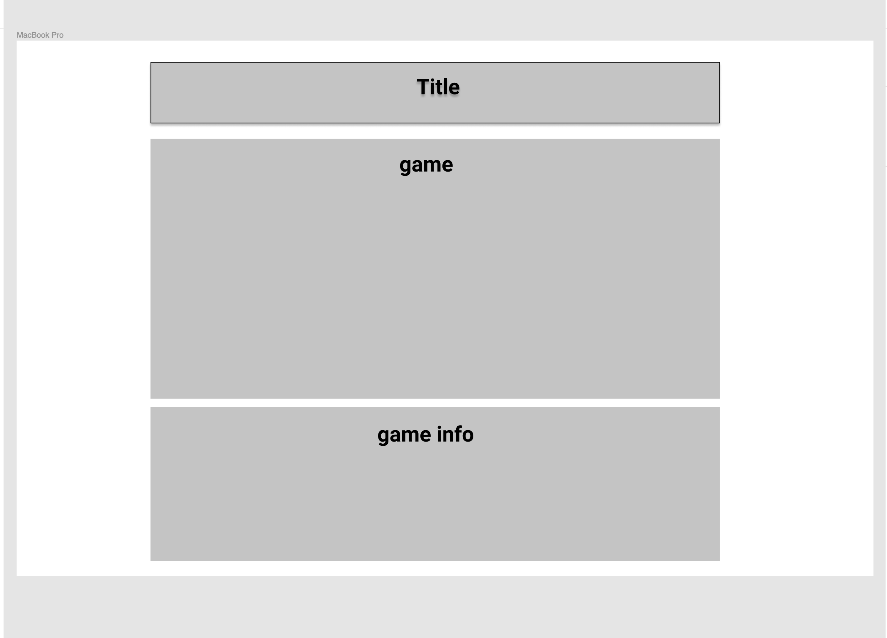

# Hangman
Creating a simple hangman game using the technology covered in class. 

## Overview 

Link to game: https://rweems-hangman.netlify.com/

## Technology Used
Html

CSS

Vanilla JavaScript

jQuery

Figma - wireframe

Stykz

Trello Link: https://trello.com/b/669qlMRH/hangman

Wireframe 

Whiteboarding

## Future Development
Add total number of wins for the player/scoreboard

Add Themes to the game
